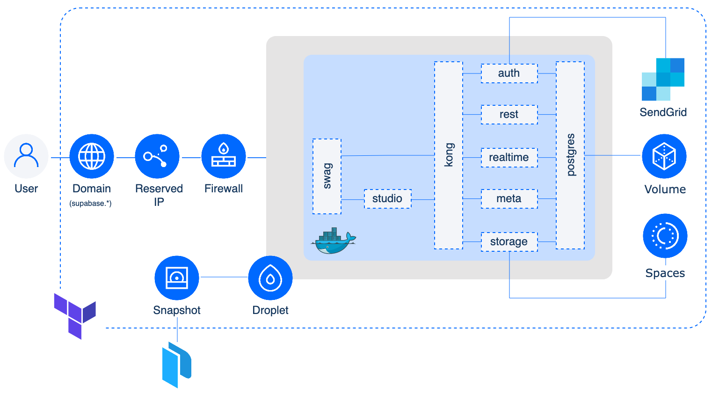

# Supabase on DigtalOcean

[Supabase](https://supabase.com/) is a backend-as-a-service platform built around the Postgres database, and is an Open Source alternative to Firebase. It can reduce time to market by providing a ready to use backend that includes a database with real time capabilities, authentication, object storage and edge functions. You can use Supabase as a service via their [managed offerings](https://supabase.com/pricing) or self-host it on your own server or on a cloud provider.

## Running Supabase on DigitalOcean

We will be deploying the following architecture.


### Docker Compose

The components that make up Supabase will be running via a [docker-compose.yml](./packer/supabase/docker-compose.yml) file. The following is taken directly from the Supabase [self-hosting documentation](https://supabase.com/docs/guides/self-hosting) page and provides a description of each of its components:

> - [Kong](https://github.com/Kong/kong) is a cloud-native API gateway.
> - [GoTrue](https://github.com/netlify/gotrue) is an SWT based API for managing users and issuing SWT tokens.
> - [PostgREST](http://postgrest.org/) is a web server that turns your PostgreSQL database directly into a RESTful API
> - [Realtime](https://github.com/supabase/realtime) is an Elixir server that allows you to listen to PostgreSQL inserts, updates, and deletes using websockets. Realtime pollsPostgres' built-in replication functionality for database changes, converts changes to JSON, then broadcasts the JSON over websockets toauthorized clients.
> - [Storage](https://github.com/supabase/storage-api) provides a RESTful interface for managing Files stored in S3, using Postgres to manage permissions.
> - [postgres-meta](https://github.com/supabase/postgres-meta) is a RESTful API for managing your Postgres, allowing you to fetch tables, add roles, and run queries, etc.
> - [PostgreSQL](https://www.postgresql.org/) is an object-relational database system with over 30 years of active development that has earned it a strong reputation forreliability, feature robustness, and performance.

In addition to the above components, the docker-compose file also runs [swag](https://docs.linuxserver.io/general/swag). SWAG (Secure Web Application Gateway) provides an Nginx webserver and reverse proxy with a built-in certbot client that automates free SSL certificate generation and renewal. It also contains [fail2ban](https://www.fail2ban.org/wiki/index.php/Main_Page) for added intrusion prevention. As swag deploys Nginx we will also use it to setup basic authentication to protect access to `studio` (the dashboard component of Supabase).

### DigitalOcean Components

All of the above will be running on a DigitalOcean Droplet. Persistent storage for the database is provided via a Volume attached to the Droplet and object storage, for artifacts like profile pics and more, will be achieved using Spaces. A Domain, Reserved IP and Firewall are also setup to ensure we can securely access our Supabase instance from the web.

### SendGrid

Supabase's auth component, `GoTrue`, requires the ability to send emails. As DigitalOcean blocks Port 25 on all Droplets for new accounts (IP reputation being a main reason for this as well as [other factors](https://www.digitalocean.com/community/tutorials/why-you-may-not-want-to-run-your-own-mail-server)) we will use [SendGrid](https://sendgrid.com/) to send emails. SendGrid offers a generous free plan of 100 emails/day which should suffice for most use cases.

### Packer and Terraform

At DigitalOcean [simplicity in all we DO](https://www.digitalocean.com/about) is one of our core values, and automating as much as possible of our processes enables us to achieve this. In this regard we will use [Packer](https://www.packer.io/) and [Terraform](https://www.terraform.io/) to automate the build and provision the resources.

## Pre-requisites

- [DigitalOcean](https://cloud.digitalocean.com/login) account (Haven't got one? Start your [free trail](https://try.digitalocean.com/freetrialoffer/) now and grab $200 in credits.);
- [SendGrid](https://app.sendgrid.com/login/) account (You can [signup](https://signup.sendgrid.com/) for free);
- [packer cli](https://developer.hashicorp.com/packer/tutorials/docker-get-started/get-started-install-cli);
- [terraform cli](https://developer.hashicorp.com/terraform/tutorials/aws-get-started/install-cli);
- curl installed on your machine (if you are running a *nix or Mac OS there is a 99.9% chance of you already having this installed. For Windows users use [WSL](https://learn.microsoft.com/en-us/windows/wsl/install));
- A Domain you own [added to DigitalOceans' Domain section](https://docs.digitalocean.com/products/networking/dns/how-to/add-domains/) and the nameservers in your chosen domain registrar pointed towards DigitalOceans' own NS records([docs](https://docs.digitalocean.com/tutorials/dns-registrars/)).

## The Manual Part

- Create a DigitalOcean API token with read/write permissions ([docs](https://docs.digitalocean.com/reference/api/create-personal-access-token/))
- Create a DO Spaces access key and secret ([docs](https://docs.digitalocean.com/products/spaces/how-to/manage-access/#access-keys))
- Create a Domain in DO and change nameservers in your domain registrar ([docs](https://docs.digitalocean.com/products/networking/dns/how-to/add-domains/))
- Create an admin (full access) SendGrid API token ([docs](https://docs.sendgrid.com/for-developers/sending-email/brite-verify#creating-a-new-api-key))
- (_Optional_) If using Terraform Cloud to manage your state file, create a [user API token](https://app.terraform.io/app/settings/tokens)

## The (Semi-)Automated Part
_We're going to run some cli commands within our terminal which can be automated within a CI/CD process._

Once we've setup and created all of the above, clone the repository:
```bash
git clone https://github.com/digitalocean/supabase-on-do.git
cd supabase-on-do
```

1. After cloning the repo, our next step is to build a snapshot of the Droplet we will be running, by following the documentation in the [packer directory](./packer).
2. And after we will deploy our resources using terraform as specified [here](./terraform).

## _TLDR_
_Or the - I didn't want to read the next sections, just give me the commands to run, I trust you - version_

### Run Packer to create the Snapshot

```bash
## From the root of the repository change directory to the packer directory
cd packer

## Copy the example file to supabase.auto.pkrvars.hcl, modify it with your own variables and save
cp supabase.auto.pkrvars.hcl.example supabase.auto.pkrvars.hcl
```

```bash
## Initialise packer to download any plugin binaries needed
packer init .

## Build the snapshot and upload it as a Snapshot on DO
packer build .
```

### Run Terraform to create the resources

```bash
## From the root of the repository change directory to the terraform directory
## (from the packer directory  use ../terraform)
cd terraform

## Copy the example file to terraform.tfvars, modify it with your own variables and save
cp terraform.tfvars.example terraform.tfvars
```

```bash
## Initialise terraform to download any plugin binaries needed
terraform init

## Create and show a plan of what will be created
## (skip if you want to apply immediately)
terraform plan

## Apply the changes specified by confirming at the prompt
## (--auto-approve if you're feeling adventures)
terraform apply
```

### Show generated passwords and tokens for later use

```bash
## Show the generated auth password
terraform output -raw htpasswd

## Show the generated psql password
terraform output -raw psql_pass

## Show the generated jwt secret and tokens
terraform output -raw jwt -raw jwt_anon -raw jwt_service_role

```