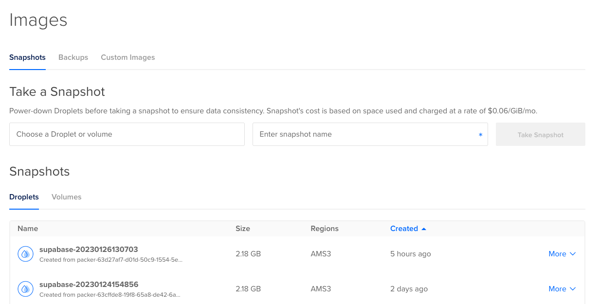

# Supabase on DigtalOcean - Packer

> _IMPORTANT:_ A note on secrets/tokens/apis. Ensure that any files containing secrets/tokens/apis are _NOT_ stored in version control.

The initial step is to create a Snapshot, using Packer, and storing it on DigitalOcean. To do this you'll have to input some variables within a `supabase.auto.pkrvars.hcl` file. An [example](./supabase.auto.pkrvars.hcl.example) file has been provided.

```bash
## From the root of the repository change directory to the packer directory
cd packer

## Copy the example file to supabase.auto.pkrvars.hcl, modify it with your own variables and save
cp supabase.auto.pkrvars.hcl.example supabase.auto.pkrvars.hcl
```

After creating the variables you can create the snapshot and upload it to DO by running the following commands:

```bash
## Initialise packer to download any plugin binaries needed
packer init .

## Build the snapshot and upload it as a Snapshot on DO
packer build .
```

## Packer file structure

**_What's happening in the background_**

 A DigitalOcean Droplet is temporarily spun up to create the Snapshot. Within this Droplet, Packer copies the [supabase](./packer/supabase) directory that contains the following files:

 ```bash
 .
├── docker-compose.yml # Containers to run Supabase on a Droplet
├── supabase.subdomain.conf # Configuration file for the swag container (runs nginx)
└── volumes
    └── db # SQL files when initialising Supabase
        ├── realtime.sql
        └── roles.sql
 ```

 and also runs the [setup script](./packer/scripts/setup.sh) that installs `docker` and `docker-compose` onto the image.

 _N.B. If you changed the image to a non Ubuntu/Debian image the script will fail as it uses the `apt` package manager. Should you wish to use a different OS, modify the script with the appropriate package manager._

 Throughout the build you might see some warnings/errors. If the build ends with showing the version of Docker Compose installed and stating that the build was successful, as shown below, you can disregard these messages. Your Snapshot name will be slightly different to the one shown below as the time the build started is appended to the name in the following format `supabase-yyyymmddhhmmss`.

```md
    digitalocean.supabase: Docker Compose version v2.15.1
==> digitalocean.supabase: Gracefully shutting down droplet...
==> digitalocean.supabase: Creating snapshot: supabase-20230126130703
==> digitalocean.supabase: Waiting for snapshot to complete...
==> digitalocean.supabase: Destroying droplet...
==> digitalocean.supabase: Deleting temporary ssh key...
Build 'digitalocean.supabase' finished after 5 minutes 8 seconds.

==> Wait completed after 5 minutes 8 seconds

==> Builds finished. The artifacts of successful builds are:
--> digitalocean.supabase: A snapshot was created: 'supabase-20230126130703' (ID: 125670916) in regions 'ams3'
```

You'll be able to see the snapshot in the images section of the DigitalOcean UI.


Now that we've created a snapshot with Docker and Docker Compose installed on it as well as the required `docker-compose.yml` and `conf` files, we will use Terraform to deploy all the resources required to have Supabase up and running on DigitalOcean. The next steps can be found in the [terraform directory](../terraform/).